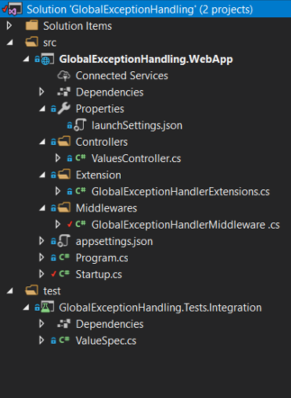
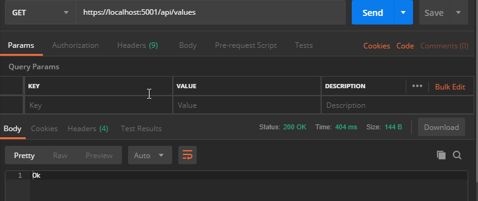
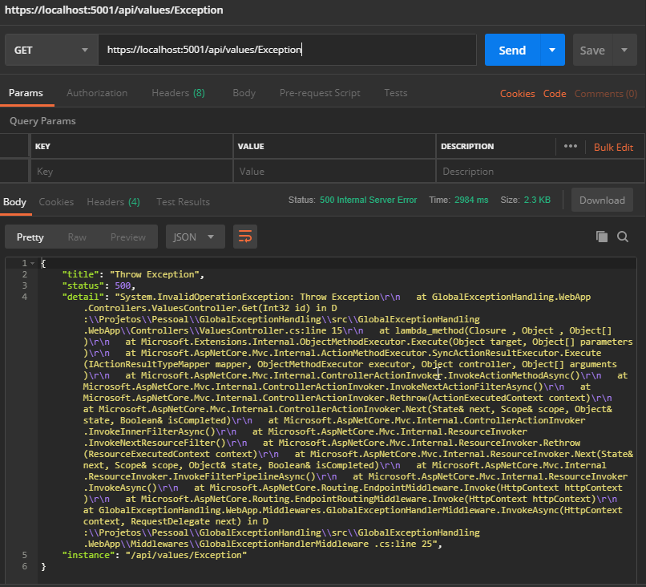
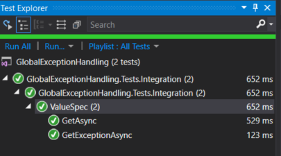

# Gerenciamento Global de Exceptions com Middleware [](https://dev.azure.com/thiagojs/Blog/_build/latest?definitionId=4&branchName=master)
Para o gerenciamento de `Exceptions` nós temos a nossa disposição o famoso [try-catch](https://docs.microsoft.com/en-us/dotnet/csharp/language-reference/keywords/try-catch) essa ferramenta é muito útil para podermos tratar as exceções especificas e também as genéricas. Porém há de concordar comigo, que um código cheio de blocos **try-catch** não é uma coisa muito estética e muito simples de ler, sem falar que o desenvolvedor pode esquecer de criar o bloco **try-catch** e uma exception ser lançada diretamente para o usuário.

Para resolver isso podemos usar alguns mecanismos de tratamento global, e hoje iremos apresentar o gerenciamento por intermédio de um middleware.

## O que são Middlewares?

Os [Middlewares](https://docs.microsoft.com/en-us/aspnet/core/fundamentals/middleware/?view=aspnetcore-2.1) basicamente são componentes que definem o *pipeline de execução dos requests HTTP*, ou seja, todos os passos que seu request faz dentro da aplicação desde a sua recepção até a resposta. Eles são encadeados, então, um middleware pode executar outro através de delegates repassando o mesmo contexto da requisição. Quando uma resposta é gerada em algum passo dentro do pipeline, a execução volta para o passo anterior e assim em diante. Você pode criar trechos de código que executam antes ou depois do próximo passo do pipeline. Eles são configurados em ordem no método Configure da classe Startup, através da interface **`IApplicationBuilder`**.


## Middlewares Customizados
Observem abaixo que a classe de gerenciamento de Exceptions criada está implementando a interface `IMiddleware`, com essa interface torna-se fácil a criação de um **Middleware**.

No construtor de nossa classe estamos passando o mecanismo de log [ILogger](https://docs.microsoft.com/en-us/aspnet/core/fundamentals/logging/?view=aspnetcore-2.2) via [DI](https://docs.microsoft.com/en-us/aspnet/core/fundamentals/dependency-injection?view=aspnetcore-2.2) para persistência dos **Exceptions** em log.

Quando implementamos a interface `IMiddleware` ganhos o método `InvokeAsync` nele que ocorre a navegação do pipeline do ASP.Net Core.

```csharp
public Task InvokeAsync(HttpContext context, RequestDelegate next)
{
    ...
}
```  
*Para continuação normal do fluxo do pipeline, não podemos esquecer de chamar o delegate **next***  

Observe abaixo que foi criado o método `HandlerAsync` onde será tratado efetivamente as **Exceptions** geradas no sistema.

```csharp
 public class GlobalExceptionHandlerMiddleware : IMiddleware
    {
        private readonly ILogger<GlobalExceptionHandlerMiddleware> logger;

        public GlobalExceptionHandlerMiddleware(ILogger<GlobalExceptionHandlerMiddleware> logger)
        {
            this.logger = logger;
        }

        public async Task InvokeAsync(HttpContext context, RequestDelegate next)
        {
            try
            {
                await next(context);
            }
            catch (Exception ex)
            {
                this.logger.LogCritical($"Ocorreu erro {ex}");
                await this.HandlerAsync(context, ex);
            }
        }

        private async Task HandlerAsync(HttpContext context, Exception ex)
        {
            var problemDetails = new ProblemDetails
            {
                Instance = context.Request.HttpContext.Request.Path
            };

            if (ex is BadHttpRequestException badHttpRequestException)
            {
                problemDetails.Title = "Requisicao invalida";
                problemDetails.Status = StatusCodes.Status400BadRequest;
                problemDetails.Detail = badHttpRequestException.Message;
            }
            else
            {
                problemDetails.Title = ex.Message;
                problemDetails.Status = StatusCodes.Status500InternalServerError;
                problemDetails.Detail = ex.ToString();
            }

            context.Response.StatusCode = problemDetails.Status.Value;
            context.Response.ContentType = "application/problem+json";

            var json = JsonConvert.SerializeObject(problemDetails, Formatting.Indented);

            await context.Response.WriteAsync(json);
        }
    }
```

No método `HandlerAsync`, estamos criando uma instancia da classe [ProblemDetails](https://docs.microsoft.com/en-us/dotnet/api/microsoft.aspnetcore.mvc.problemdetails?view=aspnetcore-2.2) que foi adicionado no ASP.Net Core 2.1. Essa classe veio para atender a [RFC 7807](https://tools.ietf.org/html/rfc7807), onde ela descreve uma maneira detalhade de apresentar problemas de requisição HTTP por meios de APIs.

Após a criação do Middleware, faz-se necessário adição do mesmo ao mecanismos de `DI` para que o controlador ASP.Net possa encaminhar de forma correta todo o fluxo de **Exceptions** quando ocorrer.

```csharp
public static class GlobalExceptionHandlerExtensions
{
    public static IServiceCollection AddGlobalExceptionHandler(this IServiceCollection services)
    {
        return services.AddTransient<GlobalExceptionHandlerMiddleware>();
    }

    public static void UseGlobalExceptionHandler(this IApplicationBuilder app)
    {
        app.UseMiddleware<GlobalExceptionHandlerMiddleware>();
    }
}
```

Acima estamos apresentando uma Extensão para facilitar a adição do mecanismo ao Pipeline e ao DI do ASP.Net Core

## E como ficou o Controlador

Como pode ser visualizado abaixo. Nosso controlador ficou absolutamente limpo, e com a segurança que todas as `Exceptions` serão tratadas corretamente, sem preocupação do desenvolvedor esquecer de implementar o bloco `try-catch`. 

```csharp
[Route("api/[controller]")]
[ApiController]
public class ValuesController : ControllerBase
{
    [HttpGet]
    public ActionResult<string> Get() => "Ok";

    [HttpGet("Exception")]
    public ActionResult Get(int id) => throw new InvalidOperationException("Throw Exception");
}
```
Para ilustrar o nosso exemplo, deixamos apenas 2 exemplos de métodos. Um que enviará corretamente a resposta como esperado e outro onde será lançado um Exceptions onde iremos colocar a prova nossa mecanismos de gerenciamento global de exceptions.

## Startup

Antes de passarmos para os nossos testes, vamos dar uma olhada como ficou a classe ´Startup´ e confiferir o uso da classe de extensão mencionada acima.

```csharp
public class Startup
{
    public Startup(IConfiguration configuration)
    {
        Configuration = configuration;
    }

    public IConfiguration Configuration { get; }

    public void ConfigureServices(IServiceCollection services)
    {
        services.AddGlobalExceptionHandler();
        services.AddMvc()
            .SetCompatibilityVersion(CompatibilityVersion.Version_2_2);
    }

    public void Configure(IApplicationBuilder app, IHostingEnvironment env)
    {
        if (env.IsDevelopment())
            app.UseDeveloperExceptionPage();
        else
            app.UseHsts();

        app.UseGlobalExceptionHandler();
        app.UseHttpsRedirection();
        app.UseMvc();
    }
}
```

Lembrando que ao adicionar a classe `UseGlobalExceptionHandler` ao Pipeline do ASP.Net Core, ela deve ficar antes do MVC!

## Estrutura do Projeto


## Testes 
Apartir de hoje nos testes iremos apresentar 2 forma. Os testes realizados normalemnte via `PostMan`, onde apresentamos os prints com os resultados e o mecanismo de testes automatizados

  
*Chamada com sucesso*

  
*Chamada com apresentação da Exception*

## Teste Automatizado
Nessa seção, estaremos apresentado os testes automatizados para validar se o mecanismos de gerenciamento global de exception está funcionando corretamente.

No código abaixo estamos fazendo a verificação se o método `GetAsync` retornou o resultado esperado corretamente e se o código Http retornado está correto.

Já os teste para o método `GetExceptionAsync` temos que verificar um conjuto de regras:
- StatuCode
- Titulo
- Instancia
- Detalhes

```csharp
 public class ValueSpec
    {
        private string WebAppName => "GlobalExceptionHandling.WebApp";
        private readonly HttpClient httpClient;
        private string testLibPath;
        private string Url => "api/Values";

        public ValueSpec()
        {
            var pathRoot = this.GetAppBasePath(this.WebAppName);
            var builder = new WebHostBuilder().UseContentRoot(pathRoot).UseEnvironment("Development").UseStartup(this.WebAppName);
            var testServer = new TestServer(builder);
            this.httpClient = testServer.CreateClient();
        }

        [Fact]
        public async Task GetAsync()
        {
            var responseMessage = await this.httpClient.GetAsync(this.Url);
            var content = await responseMessage.Content.ReadAsStringAsync();
            responseMessage.StatusCode.Should().Be(HttpStatusCode.OK);
            content.Should().Be("Ok");
        }

        [Fact]
        public async Task GetExceptionAsync()
        {
            var responseMessage = await this.httpClient.GetAsync($"{this.Url}/Exception");

            var content = await responseMessage.Content.ReadAsStringAsync();
            var problemDetails = JsonConvert.DeserializeObject<ProblemDetails>(content);

            responseMessage.StatusCode.Should().Be(HttpStatusCode.InternalServerError);
            responseMessage.Content.Headers.ContentType.ToString().Should().Be("application/problem+json");

            problemDetails.Status.Should().Be(500);
            problemDetails.Title.Should().Be("Throw Exception");
            problemDetails.Instance.Should().Be("/api/Values/Exception");
            problemDetails.Detail.Should().NotBeNullOrEmpty();
        }
        
        private string GetAppBasePath(string applicationWebSiteName)
        {
            var binPath = Environment.CurrentDirectory;
            while (!string.Equals(Path.GetFileName(binPath), "bin", StringComparison.InvariantCultureIgnoreCase))
            {
                binPath = Path.GetFullPath(Path.Combine(binPath, ".."));
                if (string.Equals(Path.GetPathRoot(binPath), binPath, StringComparison.InvariantCultureIgnoreCase))
                    throw new Exception("Could not find bin directory for test library.");
            }

            this.testLibPath = Path.GetFullPath(Path.Combine(binPath, ".."));
            var testPath = Path.GetFullPath(Path.Combine(testLibPath, ".."));
            var srcPath = Path.GetFullPath(Path.Combine(testPath, "..", "src"));

            if (!Directory.Exists(srcPath))
                throw new Exception("Could not find src directory.");

            var appBasePath = Path.Combine(srcPath, applicationWebSiteName);
            if (!Directory.Exists(appBasePath))
                throw new Exception("Could not find directory for application.");

            return appBasePath;
        }
    }
```

Observe que estamos fazendo uso o framework de teste [FluentAssertion](https://fluentassertions.com/documentation/) que facilita muito a forma como realização as verificações de asserção.  

Temos um ponto muito importante nesse código que pode ter passado despercebido, mas iremos destaca-lo agora. O construtor da classe de teste. Nele estamos criando uma instancia de [TestServer](https://docs.microsoft.com/pt-br/dotnet/api/microsoft.aspnetcore.testhost.testserver?view=aspnetcore-2.2) que é o responsável por executar em memória uma instancia do ASP.Net Core, assim é possível rodar o nosso teste sem a necessidade de publica-lo antes (*Prometo que iremos abordar todo esse conteúdo em um próximo post*).

Assim que o teste é executado com sucesso é possível ver o resultado na janela `Test Explorer`, apresentada na imagem abaixo.




## Conclusão  

Com a implementação do gerenciamento global de exception conseguimos garantir que todas as exceções serão tratadas corretamente, sem nos preocupar com um ocasional esquecimento do desenvolvedor e sem nos preocupar com mensagens indevidas para o usuário.  

Também demos um grande passo que foi a inclusão dos testes automatizados, onde podemos fazer testes de todo nosso código e garantir que não ocorrera quebras indevidas.  

Também apresentamos o padrão de comunicação ProblemaDetails que segue uma especificação da **RFC 7807**.


### Configuração do Projeto
Para escrita de projeto foi utilizado as seguintes ferramentas:
1. [Visual Studio 2017](https://visualstudio.microsoft.com/pt-br/vs/)
1. [Sdk 2.2.106](https://dotnet.microsoft.com/download/dotnet-core/2.2)
    - .Net Core Runtime 2.2.4
    - Asp .Net Core Runtime 2.2.4
1. [FluentAssertions 5.6.0](https://www.nuget.org/packages/FluentAssertions/)
1. [xunit 2.4.1](https://www.nuget.org/packages/xunit/)
1. [Microsoft.AspNetCore.TestHost 2.2.0](https://www.nuget.org/packages/Microsoft.AspNetCore.TestHost/2.2.0)  

### Referências  
[Design Guidelines for Exceptions](https://docs.microsoft.com/en-us/dotnet/standard/design-guidelines/exceptions)  
[ASP.NET Core Middleware](https://docs.microsoft.com/en-us/aspnet/core/fundamentals/middleware/?view=aspnetcore-2.1)  
[Write custom ASP.NET Core middleware](https://docs.microsoft.com/en-us/aspnet/core/fundamentals/middleware/write?view=aspnetcore-2.1)  
[Factory-based middleware activation in ASP.NET Core](https://docs.microsoft.com/en-us/aspnet/core/fundamentals/middleware/extensibility?view=aspnetcore-2.1)   
[Dependency injection in ASP.NET Core](https://docs.microsoft.com/en-us/aspnet/core/fundamentals/dependency-injection?view=aspnetcore-2.2)  
[Logging in ASP.NET Core](https://docs.microsoft.com/en-us/aspnet/core/fundamentals/logging/?view=aspnetcore-2.2)  
[ProblemDetails](https://docs.microsoft.com/en-us/dotnet/api/microsoft.aspnetcore.mvc.problemdetails?view=aspnetcore-2.2)  
[FluentAssertion](https://fluentassertions.com/documentation/)  
[Integration tests in ASP.NET Core](https://docs.microsoft.com/en-us/aspnet/core/test/integration-tests?view=aspnetcore-2.2)  


